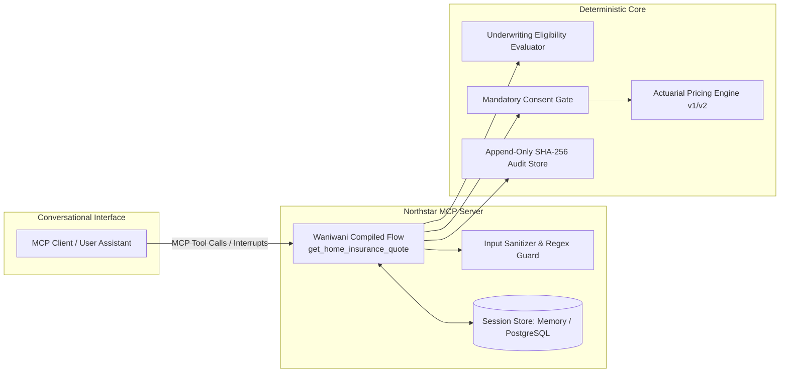

# Regulated MCP Insurance Reference Architecture

### Deterministic Quoting Architecture & Enterprise Delivery Kit for European Insurance

[](https://github.com/waalwalker1/regulated-mcp-insurance-deployment/actions/workflows/ci.yml)
[](./LICENSE)
[](https://nodejs.org)
[](https://www.typescriptlang.org/)

An open-source reference implementation demonstrating how a European residential insurer exposes a deterministic, non-binding home-insurance quote funnel through Model Context Protocol (MCP) using `@waniwani/sdk/mcp` with server-owned validation, pure pricing rules, mandatory consent gating, and tamper-evident auditability.

---

## Overview

Conversational interfaces are increasingly being evaluated for multi-step transactional workflows such as financial services and insurance quotation.

The primary engineering challenge is not extracting parameters from natural language. The primary challenge is **preserving deterministic business authority** around validation, underwriting eligibility, actuarial pricing, GDPR consent gating, state transitions, and auditability when the user interacts through a conversational assistant.

This repository provides an open-source reference implementation of that architecture. A typed Waniwani flow manages the resumable conversation, while deterministic TypeScript services own business validation, underwriting eligibility, rule-versioned pricing, persistence, and audit logging.

```text
┌─────────────────────────┐       ┌────────────────────────────────────────────────────────┐
│  Conversational Layer   │       │               Deterministic Server Core                │
│  (MCP Client / LLM)     │ ────> │  • Strict Zod Schemas & Postcode Regex Validation      │
│  • Field extraction     │       │  • Pure-Function Pricing Formulas (Versioned Rules)   │
│  • Natural language UI  │       │  • Mandatory Consent Gate & Disclosure Attachment     │
│  • Clarification loops  │       │  • Append-Only SHA-256 Cryptographic Audit Chain      │
└─────────────────────────┘       └────────────────────────────────────────────────────────┘
```

The repository supports an instant, zero-credential local mode for development as well as PostgreSQL-backed and containerized deployment paths.

---

## Architecture & State Flow



---

## Core Design Principles

1. **Server Authority:** The conversational model is strictly an extraction and rendering interface. The compiled server owns state transitions, required fields, validation, eligibility, pricing calculations, rule versions, consent gating, and audit logging.
2. **Actuarial Determinism:** Premiums are calculated via pure functions in compiled TypeScript ([`packages/rules/src/pricing.ts`](./packages/rules/src/pricing.ts)). AI outputs can never directly set or alter premiums, multipliers, taxes, or eligibility outcomes.
3. **Explicit Consent Gating:** Quote calculation is strictly blocked until explicit data processing consent is recorded (`[CONSENT_REQUIRED]`).
4. **Tamper-Evident Auditability:** Every lifecycle event appends a SHA-256 hash chaining back to session genesis ([`packages/audit/src/audit-store.ts`](./packages/audit/src/audit-store.ts)).
5. **Idempotency & Replay Safety:** Quote calculations and adjustments accept idempotency keys and return cached quotes with audit tracking (`request.replayed`). Conflicting payloads on the same key are safely rejected.
6. **Zero-Credential Local Run:** The entire workflow runs locally out-of-the-box with zero external API keys or cloud dependencies.

---

## Features & Capabilities

- **Resumable Conversational Funnel:** Genuine `@waniwani/sdk/mcp` state graph (`createFlow`, `interrupt`, `START`, `END`) compiled and registered as **one primary MCP tool** (`get_home_insurance_quote`).
- **Multi-Country European Addressing:** Regex-validated postcode formats for France (`FR`), Spain (`ES`), Portugal (`PT`), Germany (`DE`), and Italy (`IT`) with conversational re-asking on invalid formatting.
- **Underwriting Eligibility & Referrals:** Evaluates risk combinations (e.g. claims $\ge 4$, large villas $>250\text{ m}^2$) and emits explicit machine-readable reason codes.
- **State Correction & Tiered Invalidation Loops:** Altering previously confirmed structural risk parameters automatically invalidates active quotes and resets consent.
- **Dynamic Quote Adjustment:** Modify coverage tiers (`essential`, `comfort`, `premium`) and deductibles (€150 to €1000) on active quotes with idempotency protection.
- **Official MCP Streamable HTTP Transport:** Direct `StreamableHTTPServerTransport` integration supporting stateful sessions, `/health`, and `/ready` probes.
- **Dual Persistence Adapters:** Pluggable in-memory TTL store and real PostgreSQL adapter with parameterized SQL, schema migrations, and optimistic concurrency control.
- **GDPR Right to Erasure:** Multi-table scrubbing removing contact emails from `quote_sessions` and `quote_history` while preserving cryptographic audit validity.

---

## Quickstart

### Prerequisites

- Node.js `v20.x` or later
- npm `v10.x` or later (Docker optional for containerized PostgreSQL)

### Installation & Run

```bash
# 1. Install dependencies (idempotent, local)
npm run setup

# 2. Run the full interactive demonstration
npm run demo

# 3. Run all unit, protocol, property, and integration tests
npm test

# 4. Run the 24-scenario automated evaluation benchmark
npm run eval

# 5. Execute all quality gates
npm run release-check
```

---

## Example Quotation Workflow

```text
[User]      "Hi, I need home insurance for my apartment in Paris (75008)."
[Assistant] Invokes tool: get_home_insurance_quote
[Server]    -> Interrupt: missing structural risk details (construction period, floor area, claims).

[User]      "It was built in 2010, 75 sqm, primary residence, 0 claims in past 5 years."
[Assistant] Resumes get_home_insurance_quote with risk factors
[Server]    -> Evaluates Eligibility: ELIGIBLE (Reason: RISK_CRITERIA_MET). Rule version: northstar-home-eu-v1.
            -> Interrupt: Select coverage tier and deductible.

[User]      "I'd like the Comfort tier with a €300 deductible."
[Assistant] Resumes get_home_insurance_quote
[Server]    -> Interrupt: Customer must confirm declared summary parameters.

[User]      "I confirm all details are correct."
[Assistant] Resumes get_home_insurance_quote with parametersConfirmed: true
[Server]    -> Interrupt: Explicit GDPR consent required (consent_v1_2026).

[User]      "I consent to data processing for this quotation."
[Assistant] Resumes get_home_insurance_quote with hasConsented: true
[Server]    -> QUOTE ISSUED (ID: 90484678-f868...)
               Base Annual: €180.00 | Property Multiplier: x0.9 | Deductible Discount: -€25.00
               Net Annual:  €137.00 | Tax (18%): +€24.66
               TOTAL:       €161.66 / year (€13.47 / month)
               Fingerprint: 36d5b534f844c6e43243398f3fb42436c251712183d3e0036f239a7bc168d56a (SHA-256)
               Status:      Active (Non-binding indicative)
```

---

## Repository Structure

```text
├── apps/
│   ├── mcp-server/              # Waniwani compiled flow + MCP server (Stdio / Streamable HTTP)
│   └── pricing-service/         # Fastify microservice (/health, /ready, /calculate)
├── packages/
│   ├── domain/                  # Zod validation schemas, error taxonomy, state machine
│   ├── rules/                   # Actuarial pricing engine, versioned rules (v1, v2), eligibility
│   ├── persistence/             # SessionStore (InMemory with TTL & PostgreSQL)
│   ├── audit/                   # Append-only audit store with SHA-256 hash chaining & redactor
│   └── security/                # Input sanitization, prompt injection detection, data catalog
├── docs/
│   ├── architecture/            # STRIDE threat model, Hosted vs VPC blueprints, Data Flow
│   ├── decisions/               # Architecture Decision Records (ADRs)
│   ├── demo/                    # Interactive demo scripts and technical walkthroughs
│   ├── enterprise-delivery/     # Discovery questionnaire, RTM, RACI, UAT, and Go-Live plans
│   ├── guides/                  # Technical deep dives and architecture failure mode guides
│   ├── operations/              # Operational runbook, migrations, and audit verification
│   ├── procurement/             # 35-question security questionnaire, DPIA template, data catalog
│   ├── IMPLEMENTATION.md        # Technical implementation summary
│   ├── RELEASE_VALIDATION.md    # Release verification record
│   └── VERIFICATION_MATRIX.md   # Requirement-to-test traceability matrix
├── tests/                       # Unit, protocol, integration, property (fast-check), and adversarial tests
├── scripts/
│   ├── demo-flow.ts             # Interactive demonstration runner
│   ├── run-eval.ts              # 24-scenario automated evaluation benchmark
│   ├── verify-audit.ts          # Cryptographic audit hash chain verification CLI
│   ├── migrate.ts               # Database schema migration runner
│   └── anonymize-session.ts     # Right-to-erasure / session anonymization utility
├── Makefile                     # Canonical developer command interface
├── docker-compose.yml           # Local multi-container deployment stack
└── .github/workflows/ci.yml     # Automated CI verification pipeline
```

---

## Testing & Verification

All architectural guarantees and invariants are verified via automated tests and reproducible evaluation benchmarks:

| Evaluation Dimension                   | Measurement Tool                             | Scenarios / Tests          | Measured Result                     |
| -------------------------------------- | -------------------------------------------- | -------------------------- | ----------------------------------- |
| **Code Formatting**                    | Prettier (`npm run format:check`)            | Whole Repository           | **100% Compliant**                  |
| **Static Code Analysis**               | ESLint (`npm run lint`)                      | Monorepo TypeScript Files  | **0 Errors**                        |
| **Type Safety**                        | TypeScript Compiler (`npm run typecheck`)    | Monorepo Strict Mode       | **0 Type Errors**                   |
| **Unit, Protocol & Integration Suite** | Vitest Test Runner (`npm run test`)          | 26 Test Files, 76 Tests    | **76 Passed (100%)**                |
| **Evaluation Benchmark**               | Automated Evaluation Runner (`npm run eval`) | 24 Multi-Country Scenarios | **24 Passed (100%, 7ms execution)** |
| **Security Audit**                     | npm Dependency Audit (`npm run security`)    | Production Dependencies    | **0 High/Critical Vulnerabilities** |
| **Audit Chain Integrity**              | SHA-256 Cryptographic Verification           | Lifecycle Event Logs       | **100% Unbroken Hash Chains**       |

_Detailed requirement-to-test traceability is documented in [`docs/VERIFICATION_MATRIX.md`](./docs/VERIFICATION_MATRIX.md)._

---

## Deployment Modes

### 1. Local Stdio Mode (Default)

Used by MCP desktop clients (e.g. Claude Desktop, IDE extensions). Sessions and audit trails are stored in-memory with automatic TTL cleanup.

```bash
npm run dev
```

### 2. Streamable HTTP Network Mode

Exposes standard MCP endpoints over HTTP using `StreamableHTTPServerTransport` with JSON-RPC streaming, `/health`, and `/ready` probes.

```bash
MCP_TRANSPORT=http PORT=3000 npm run dev
```

### 3. Docker Compose Stack (PostgreSQL + MCP Server + Pricing Service)

Runs the full multi-service architecture locally with durable PostgreSQL storage and database migrations.

```bash
docker compose up --build
```

---

## Enterprise Delivery & Security Documentation

The repository includes enterprise documentation templates and blueprints designed for regulated technical reviews:

- **[Technical Implementation Summary](./docs/IMPLEMENTATION.md)**
- **[Requirements & Verification Matrix](./docs/VERIFICATION_MATRIX.md)**
- **[Release Validation Record](./docs/RELEASE_VALIDATION.md)**
- **[Architecture Decision Records (ADRs)](./docs/decisions/)**
- **[Enterprise Delivery Pack](./docs/enterprise-delivery/)** (Discovery, RTM, RACI, UAT, Go-Live, Rollback)
- **[Enterprise Security & Procurement Library](./docs/procurement/)** (35-Question Questionnaire, DPIA, Shared Responsibility)
- **[STRIDE Threat Model](./docs/architecture/THREAT_MODEL.md)**
- **[Operations Runbook](./docs/operations/RUNBOOK.md)**
- **[Technical Deep Dive Guide](./docs/guides/TECHNICAL_DEEP_DIVE.md)**
- **[Demo Walkthrough Guide](./docs/demo/DEMO_WALKTHROUGH.md)**

---

## Security & Privacy

- **Data Minimization:** No personal data (e.g. email) is collected or processed until the explicit quotation delivery step.
- **Cryptographic Auditability:** All state transitions and calculations append to an immutable, hash-chained audit log.
- **Automated PII Redaction:** Structured log metadata masks email addresses and authentication tokens before hashing or logging.
- **Right to Erasure:** Session anonymization utility scrubs PII across sessions and quote history tables while preserving audit chain integrity.
- **Prompt Injection Defense:** Input sanitizers validate formats and reject instruction injection attempts in address and metadata fields.

---

## Known Limitations

1. **Synthetic Reference Insurer:** Northstar Home Insurance EU is a synthetic reference model for demonstration and educational purposes.
2. **Non-Binding Quotations:** Generated quotes are indicative estimates and do not bind formal underwriting policies or collect financial payment.
3. **Illustrative Actuarial Factors:** Pricing formulas and risk multipliers in `packages/rules/src/v1.ts` are demonstration values and do not represent proprietary actuarial tables.

---

## Non-Affiliation Statement & License

This repository is an independent open-source reference implementation built with public MIT-licensed packages (`@waniwani/sdk`, `@modelcontextprotocol/sdk`). It is not affiliated with, endorsed by, or sponsored by Waniwani AI, Anthropic, or any commercial insurer.

Licensed under the [MIT License](./LICENSE).
