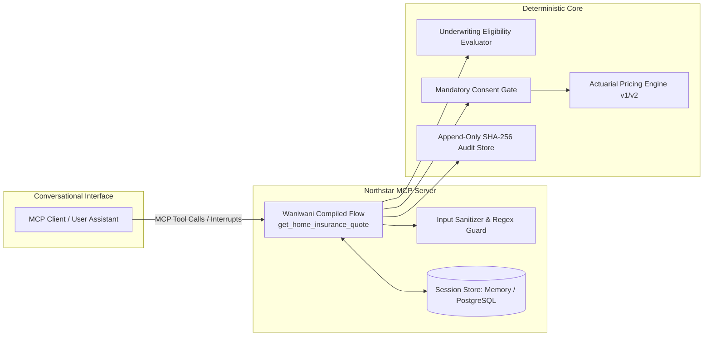

# Regulated MCP Insurance Deployment Kit
### Deterministic Quoting Architecture & Enterprise Delivery Kit for European Insurance

[](https://github.com/waalwalker1/regulated-mcp-insurance-deployment/actions/workflows/ci.yml)
[](./LICENSE)
[](https://nodejs.org)
[](https://www.typescriptlang.org/)

> **A production-shaped reference implementation demonstrating how a European insurer exposes a deterministic, non-binding home-insurance quote funnel through Model Context Protocol (MCP) using `@waniwani/sdk/mcp` with server-owned validation, pricing calculations, mandatory consent gating, and tamper-evident auditability.**

---

## ⚡ 90-Second Recruiter & Hiring Manager Scan

- **Target Role:** Waniwani Forward Deployed Engineer (FDE) / Regulated Enterprise AI Solutions Architect.
- **Core Problem Solved:** Conversational AI models hallucinate prices, bypass consent gates, and lack deterministic auditability. This kit implements the **deterministic server-authority pattern**: the AI assistant provides conversational natural-language extraction, while the compiled server core owns all state transitions, validation, actuarial formulas, consent gating, and cryptographic audit logging.
- **SDK & Protocol Integration:** Genuine `@waniwani/sdk/mcp` typed flow (`createFlow`, `StateGraph`, `interrupt`, conditional branching) compiled and registered as **one primary MCP tool** (`get_home_insurance_quote`) on a standard `McpServer`.
- **Zero-Credential Local Run:** The entire P0 workflow runs 100% locally with zero external API keys or cloud dependencies (`make demo`, `make test`, `make eval`).
- **Proof-of-Work Evidence:**
  - **19 Test Files / 55 Vitest Tests (100% passing)** spanning domain, rules, persistence, audit, protocol transports, idempotency, state order, property-based tests (`fast-check`), and adversarial attacks.
  - **24 Automated Evaluation Scenarios (100% passing in 7ms)** across 5 European countries (FR, ES, PT, DE, IT).
  - **Real Persistence & Durable Audit:** Pluggable in-memory TTL store and real PostgreSQL adapter with parameterized SQL, schema migrations, and SHA-256 hash chain verification across restarts.
  - **Enterprise FDE & Procurement Pack:** 32 enterprise artifacts including a 35-question security questionnaire, STRIDE threat model, RTM, RACI, and UAT plans.

---

## 1. Architecture & State Flow



### Core Invariants
1. **Server Pricing Authority:** Premiums are calculated via pure functions in compiled TypeScript ([`packages/rules/src/pricing.ts`](./packages/rules/src/pricing.ts)). LLM output can never directly set or alter premiums, multipliers, taxes, or eligibility outcomes.
2. **Mandatory Consent Gate:** Quote calculation is hard-blocked until explicit data processing consent is recorded (`[CONSENT_REQUIRED]`).
3. **Cryptographic Audit Trail:** Every lifecycle event appends a SHA-256 hash chaining back to session genesis ([`packages/audit/src/audit-store.ts`](./packages/audit/src/audit-store.ts)).
4. **Idempotency & Replay Safety:** Quote calculations and adjustments accept idempotency keys and return cached quotes with audit tracking (`request.replayed`).
5. **Zero-Credential Local Path:** Fully testable and runnable locally without paid third-party API credentials.

---

## 2. Key Capabilities

- **Multi-Country European Addressing:** Regex-validated postcode formats for France (`FR`), Spain (`ES`), Portugal (`PT`), Germany (`DE`), and Italy (`IT`).
- **Underwriting Eligibility & Referrals:** Evaluates risk combinations (e.g. claims $>3$, large high-value villas) and emits explicit machine-readable reason codes.
- **State Correction & Tiered Invalidation Loops:** Altering previously confirmed structural risk parameters automatically invalidates active quotes and resets consent.
- **Dynamic Quote Adjustment:** Modify coverage tiers (`essential`, `comfort`, `premium`) and deductibles (€150 to €1000) on active quotes with idempotency protection.
- **Hosted SaaS & Customer VPC Blueprints:** Complete deployment manifests, Docker Compose local stack, and a multi-criteria decision matrix.
- **Enterprise Delivery & Procurement Pack:** 32 comprehensive artifacts including a 35-question security questionnaire, STRIDE threat model, RTM, RACI, and UAT plans.

---

## 3. Quickstart

### Prerequisites
- Node.js `v20.x` or later
- npm `v10.x` or later (Docker optional for containerized PostgreSQL)

### 1-Command Verification
```bash
# 1. Install dependencies (idempotent, local)
make setup

# 2. Run the full interactive demonstration
make demo

# 3. Run all unit, protocol, property, and integration tests (55 tests)
make test

# 4. Run the 24-scenario automated evaluation benchmark
make eval

# 5. Execute all release audit quality gates
make release-check
```

---

## 4. 60-Second Quoting Transcript

```text
[User]      "Hi, I need home insurance for my apartment in Paris (75008)."
[Assistant] Invokes tool: get_home_insurance_quote
[Server]    -> Interrupt: missing structural risk details (construction period, floor area, claims).

[User]      "It was built in 2010, 75 sqm, primary residence, 0 claims in past 5 years."
[Assistant] Resumes get_home_insurance_quote with risk factors
[Server]    -> Evaluates Eligibility: ELIGIBLE (Reason: RISK_CRITERIA_MET). Rule version: northstar-home-eu-v1.
            -> Interrupt: Select coverage tier and deductible.

[User]      "I'd like the Comfort tier with a €300 deductible."
[Assistant] Resumes get_home_insurance_quote
[Server]    -> Interrupt: Customer must confirm declared summary parameters.

[User]      "I confirm all details are correct."
[Assistant] Resumes get_home_insurance_quote with parametersConfirmed: true
[Server]    -> Interrupt: Explicit GDPR consent required (consent_v1_2026).

[User]      "I consent to data processing for this quotation."
[Assistant] Resumes get_home_insurance_quote with hasConsented: true
[Server]    -> QUOTE ISSUED (ID: 90484678-f868...)
               Base Annual: €180.00 | Property Multiplier: x0.9 | Deductible Discount: -€25.00
               Net Annual:  €137.00 | Tax (18%): +€24.66
               TOTAL:       €161.66 / year (€13.47 / month)
               Fingerprint: 36d5b534f844c6e43243398f3fb42436c251712183d3e0036f239a7bc168d56a (SHA-256)
               Status:      Active (Non-binding indicative)
```

---

## 5. Repository Structure

```text
├── apps/
│   ├── mcp-server/              # Waniwani compiled flow + MCP server (Stdio/HTTP)
│   └── pricing-service/         # Fastify microservice (/health, /ready, /metrics, /calculate)
├── packages/
│   ├── domain/                  # Zod validation schemas, error taxonomy, state machine
│   ├── rules/                   # Actuarial pricing engine, versioned rules (v1, v2), eligibility
│   ├── persistence/             # SessionStore (InMemory with TTL & real PostgreSQL)
│   ├── audit/                   # Append-only audit store with SHA-256 hash chaining & redactor
│   └── security/                # Input sanitization, prompt injection detection, data catalog
├── docs/
│   ├── CLAIMS_EVIDENCE_MATRIX.md # Complete claim-to-code traceability matrix
│   ├── fde/                     # 16-document Enterprise FDE Delivery Pack (RTM, RACI, UAT, etc.)
│   ├── procurement/             # 16-document Procurement & Security Library (35-question FAQ, DPIA)
│   ├── architecture/            # Threat model (STRIDE), Hosted vs VPC blueprints, Data Flow
│   ├── operations/              # Operational Runbook, migrations, and audit verification
│   └── portfolio/               # Role requirement map, interview walkthrough, STAR stories
├── tests/                       # Unit, protocol, integration, property (fast-check), and adversarial tests
├── scripts/
│   ├── demo-flow.ts             # Interactive demonstration runner
│   ├── run-eval.ts              # 24-scenario automated evaluation benchmark
│   ├── verify-audit.ts          # Cryptographic audit hash chain verification CLI
│   ├── migrate.ts               # Database schema migration runner
│   └── anonymize-session.ts     # Right-to-erasure / session anonymization utility
├── Makefile                     # Canonical developer command interface
├── docker-compose.yml           # Local multi-container deployment stack
└── .github/workflows/ci.yml     # Automated CI verification pipeline
```

---

## 6. Measured Evidence & Evaluation Results

All claims in this repository are backed by passing code and automated evaluation benchmarks:

| Evaluation Dimension | Measurement Tool | Scenarios / Tests | Measured Result |
|---|---|---|---|
| **Type Safety** | TypeScript Compiler (`tsc --noEmit`) | Monorepo Strict Mode | **0 Type Errors** |
| **Unit, Protocol & Integration Suite** | Vitest Test Runner (`npm run test`) | 19 Test Files, 55 Tests | **55 Passed (100%)** |
| **Evaluation Benchmark** | Automated Evaluation Runner (`npm run eval`) | 24 Multi-Country Scenarios | **24 Passed (100%, 7ms execution)** |
| **Security Audit** | npm Dependency Audit (`npm run security`) | Production Dependencies | **0 High/Critical Vulnerabilities** |
| **Audit Chain Integrity** | SHA-256 Cryptographic Verification | Lifecycle Event Logs | **100% Unbroken Hash Chains** |

*Detailed claim verification is maintained in [`docs/CLAIMS_EVIDENCE_MATRIX.md`](./docs/CLAIMS_EVIDENCE_MATRIX.md).*

---

## 7. Enterprise Delivery & Procurement Pack

- **[Executive Solution Brief](./docs/fde/00-executive-solution-brief.md)**
- **[Client Discovery Questionnaire](./docs/fde/01-client-discovery-questionnaire.md)**
- **[Requirements Traceability Matrix (RTM)](./docs/fde/03-requirements-traceability-matrix.md)**
- **[Hosted vs. Self-Hosted Decision Matrix](./docs/fde/07-hosted-vs-self-hosted-decision-matrix.md)**
- **[35-Question Enterprise Security Questionnaire](./docs/procurement/12-security-questionnaire-sample.md)**
- **[STRIDE Threat Model](./docs/architecture/THREAT_MODEL.md)**
- **[Data Protection Impact Assessment (DPIA) Inputs](./docs/procurement/14-dpia-input-template.md)**
- **[Claims-Evidence Traceability Matrix](./docs/CLAIMS_EVIDENCE_MATRIX.md)**
- **[Operations Runbook](./docs/operations/RUNBOOK.md)**

---

## 8. Known Limitations

1. **Indicative Quotation Only:** Northstar Home Insurance EU is a synthetic reference model. Issued quotes are non-binding estimates and do not bind legal underwriting contracts or collect payment.
2. **Illustrative Actuarial Factors:** Pricing coefficients in `packages/rules/src/v1.ts` are simplified demonstration multipliers and do not reflect proprietary actuarial tables.
3. **No External Cloud Deployment Claim:** The repository is validated locally via zero-credential runners and Docker Compose; no third-party cloud infrastructure was provisioned.

---

## 9. Non-Affiliation Statement & License

This repository is an independent technical proof-of-work demonstration built with open-source MIT-licensed packages (`@waniwani/sdk`, `@modelcontextprotocol/sdk`). It is not affiliated with, endorsed by, or sponsored by Waniwani AI, Anthropic, or any commercial insurer.

Licensed under the [MIT License](./LICENSE).
