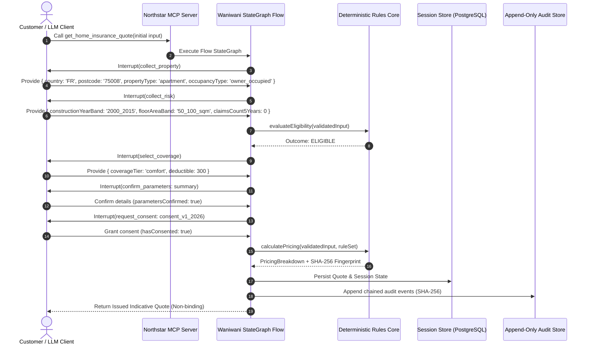
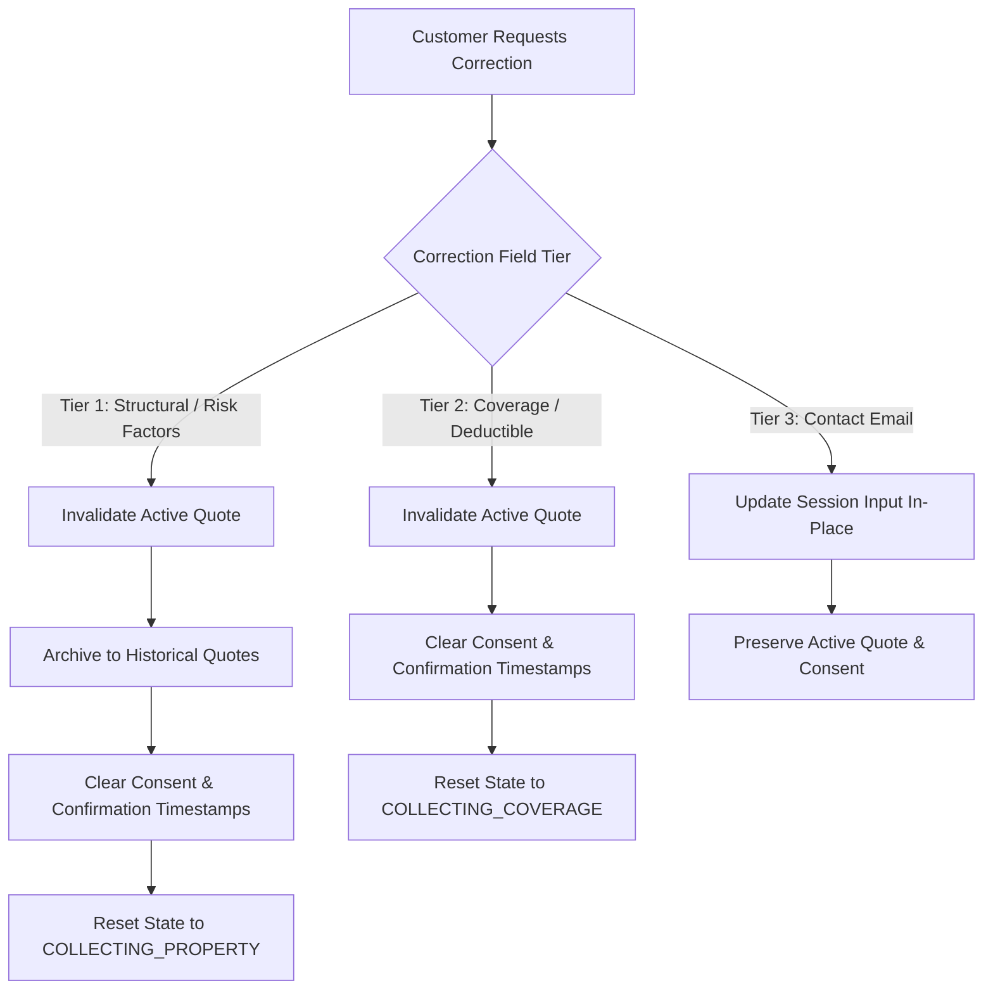

# End-to-End Quotation Data Flow Architecture

## 1. High-Level Lifecycle Flow

---

## 2. Invalidation & Correction Data Flow

---

## 3. Cryptographic Hash Chain Data Flow

Every audit event is cryptographically linked to its predecessor:

$$\text{Event}_{n}.\text{currentHash} = \text{SHA256}\left(\text{Event}_{n-1}.\text{currentHash} \parallel \text{Event}_{n}.\text{eventId} \parallel \text{Event}_{n}.\text{sessionId} \parallel \dots\right)$$

This provides a tamper-evident audit record and allows deterministic external verification via `npm run audit:verify -- <sessionId>`. Verification validates that retained events have not been modified, inserted, or reordered within the sequence. Detecting tail-deletion requires an externally retained final event hash or record count.
