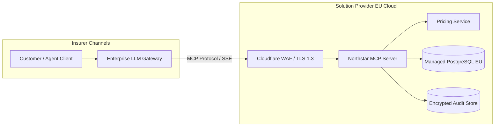
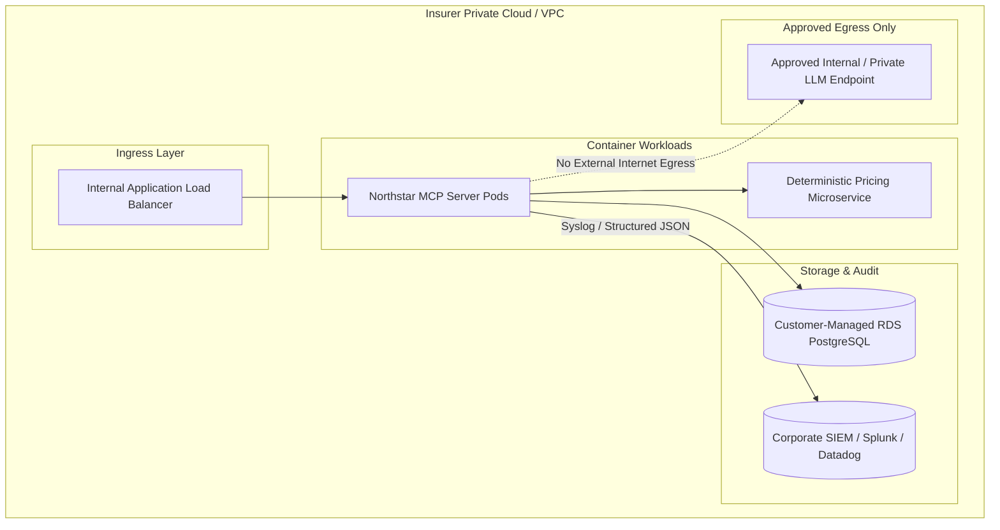

# Hosted vs. Self-Hosted Deployment Architectures

## 1. Overview
The Northstar Regulated MCP Insurance Deployment Kit provides two distinct deployment topologies tailored for European enterprise insurers:
1. **Hosted SaaS Model:** Managed by the solution provider with strict European data residency boundaries.
2. **Customer-Controlled / Self-Hosted VPC Model:** Deployed entirely inside the insurer's private cloud (AWS/Azure/GCP VPC or on-prem Kubernetes cluster).

---

## 2. Architecture Comparison

### Pattern A: European Hosted SaaS Deployment
In this topology, the MCP gateway and pricing microservice are hosted in a dedicated EU cloud region (e.g. `eu-west-3` Paris or `eu-central-1` Frankfurt).

**Key Characteristics:**
- **Zero Infrastructure Burden:** Fast implementation cycle (2–4 weeks from contract to pilot).
- **Data Residency:** All data stored and processed within EU member state datacenters.
- **Security Boundary:** Hardened TLS 1.3 endpoints with API key and IP allowlisting.

---

### Pattern B: Customer-Controlled / Self-Hosted VPC Deployment
In this topology, the kit runs entirely within the insurer's private VPC. No conversational state or personal data leaves the insurer's security perimeter.

**Key Characteristics:**
- **Total Data Sovereignty:** Zero data transits third-party SaaS infrastructure.
- **Direct Core Banking / Policy System Integration:** Low-latency access to internal actuarial services.
- **Air-Gapped / Egress-Denied Option:** Containers can run in subnets with no internet egress.
