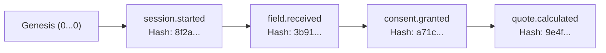

# State Persistence and Audit Architecture

## 1. State Persistence Strategy
The kit implements a modular persistence interface ([`SessionStore`](file:///Users/dhananjay/Library/CloudStorage/OneDrive-URV/Personal%20Docs/CV/GitHub_Projects_JOB/WaniWani/packages/persistence/src/store.interface.ts)) supporting two deployment topologies:

```mermaid
flowchart TD
    A[MCP Client / Fastify API] --> B[FunnelEngine]
    B --> C{PERSISTENCE_MODE}
    C -->|memory (default)| D[InMemorySessionStore]
    C -->|postgres| E[PostgresSessionStore]
    D --> F[(In-Memory Session Map with TTL)]
    E --> G[(PostgreSQL Docker / Managed DB)]
```

### Persistence Features
- **Session Isolation:** Every session is keyed by an unguessable UUID. Tenant cross-talk is prevented.
- **Time-to-Live (TTL):** Sessions expire after a configurable duration (default: 3600 seconds). Expired sessions cannot be accessed or modified.
- **Right-to-Erasure:** Individual sessions can be scrubbed on demand via [`scripts/anonymize-session.ts`](file:///Users/dhananjay/Library/CloudStorage/OneDrive-URV/Personal%20Docs/CV/GitHub_Projects_JOB/WaniWani/scripts/anonymize-session.ts).

---

## 2. Append-Only Application Audit Trail
Every interaction, field input, rejection, calculation, and consent grant emits an immutable `AuditEvent`.

### Hash Chain Mechanics
Each event calculates a SHA-256 cryptographic digest over its own fields combined with the prior event's hash:

$$\text{currentHash} = \text{SHA256}\left(\text{previousHash} \parallel \text{eventId} \parallel \text{sessionId} \parallel \text{correlationId} \parallel \text{timestamp} \parallel \text{eventType} \parallel \text{actor} \parallel \text{JSON}(\text{metadata})\right)$$

The initial event for any session anchors to a well-known genesis hash (`0` repeated 64 times).



### Verification
The `verifyChainIntegrity(sessionId)` method traverses the event log from genesis, re-computing each SHA-256 hash. Any retroactive mutation or truncation of the log results in an immediate verification failure.

### PII Minimization in Audit Logs
Raw personal data (such as emails or access tokens) is automatically redacted by the audit store redactor before hashing and storage (`jane.doe@example.com` becomes `ja***@example.com`).
