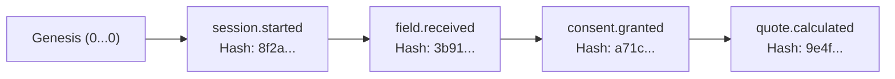

# State Persistence and Audit Architecture

## 1. State Persistence Strategy

The kit implements a modular persistence interface ([`SessionStore`](../../packages/persistence/src/store.interface.ts)) supporting two deployment topologies:

```mermaid
flowchart TD
    A[MCP Client / Fastify API] --> B[FunnelEngine]
    B --> C{PERSISTENCE_MODE}
    C -->|memory (default)| D[InMemorySessionStore]
    C -->|postgres| E[PostgresSessionStore]
    D --> F[(In-Memory Session Map with TTL)]
    E --> G[(PostgreSQL Docker / Managed DB)]
```

### Persistence Features

- **Session Isolation:** Every session is keyed by an unguessable UUID. Cross-session state leakage is prevented.
- **Time-to-Live (TTL):** Sessions expire after a configurable duration (default: 3600 seconds). Expired sessions cannot be accessed or modified.
- **Contact-Data Anonymization:** Individual sessions and historical snapshots can be scrubbed of personal contact data on demand via [`scripts/anonymize-session.ts`](../../scripts/anonymize-session.ts).

---

## 2. Append-Only Application Audit Trail

Every interaction, field input, rejection, calculation, and consent grant emits an append-only `AuditEvent` at the application layer.

### Hash Chain Mechanics

Each event calculates a SHA-256 cryptographic digest over its own fields combined with the prior event's hash:

$$\text{currentHash} = \text{SHA256}\left(\text{previousHash} \parallel \text{eventId} \parallel \text{sessionId} \parallel \text{correlationId} \parallel \text{timestamp} \parallel \text{eventType} \parallel \text{actor} \parallel \text{JSON}(\text{metadata})\right)$$

The initial event for any session anchors to a well-known genesis hash (`0` repeated 64 times).



### Verification & Tamper-Evidence

The `verifyChainIntegrity(sessionId)` method traverses the event log from genesis, re-computing each SHA-256 hash. Any retroactive mutation, insertion, or reordering within the sequence results in an immediate verification failure.

_Limitation:_ A valid prefix of the chain can still verify after deletion of trailing events unless a trusted external terminal checkpoint, event count, or independently stored final hash is retained. The audit log is therefore described as tamper-evident rather than tamper-proof or immutable.

### PII Minimization in Audit Logs

Raw personal data (such as emails or access tokens) is automatically redacted by the audit store redactor before hashing and storage (`jane.doe@example.com` becomes `ja***@example.com`).
