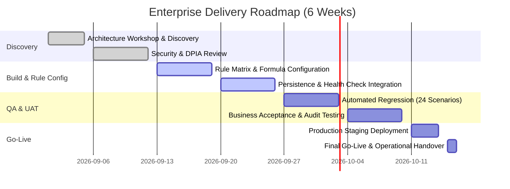

# Enterprise Delivery Plan (Signed Deal to Live Deployment)

---

## Weekly Milestone Breakdown
- **Week 1 (Discovery & Scoping):** Execute discovery questionnaire, finalize RTM, lock in/out of scope definitions.
- **Week 2 (Security & Compliance):** Deliver security questionnaire response library, DPIA input data flows, and threat model review.
- **Week 3 (Actuarial Integration):** Configure country base rates and risk multipliers in `packages/rules/src/v1.ts`. Run unit tests.
- **Week 4 (Infrastructure Setup):** Stand up Docker Compose or customer VPC container instances. Validate PostgreSQL schema migrations and TTL expiry.
- **Week 5 (UAT & Adversarial QA):** Execute 24-scenario benchmark suite. Verify 100% pass rate and unbroken audit hash chains.
- **Week 6 (Go-Live & Handover):** Execute production go-live checklist, train operational support staff, and transition to BAU.
