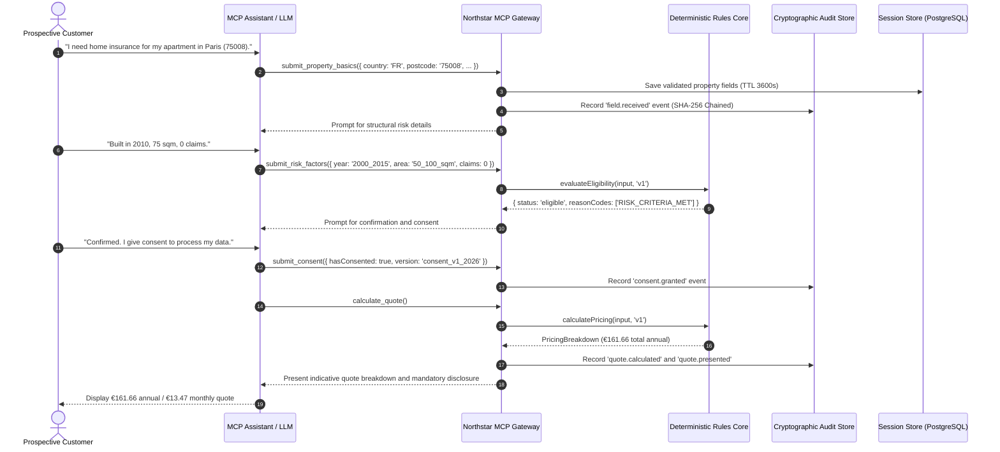

# Data Flow and Classification Guide

## 1. Data Classification Inventory

| Data Element           | Sensitivity Tier | Purpose                                   | Storage Target              | Retention Period                | Redacted in Logs?           |
| ---------------------- | ---------------- | ----------------------------------------- | --------------------------- | ------------------------------- | --------------------------- |
| `country`              | INTERNAL         | Regional pricing & tax rate determination | Session Store / Audit Event | 30 days (Session TTL)           | No                          |
| `postcode`             | INTERNAL         | Geographic risk zone calculation          | Session Store / Audit Event | 30 days                         | No                          |
| `propertyType`         | INTERNAL         | Structural risk multiplier                | Session Store / Audit Event | 30 days                         | No                          |
| `occupancyType`        | INTERNAL         | Occupancy risk multiplier                 | Session Store / Audit Event | 30 days                         | No                          |
| `floorAreaBand`        | INTERNAL         | Volume multiplier                         | Session Store / Audit Event | 30 days                         | No                          |
| `constructionYearBand` | INTERNAL         | Infrastructure age multiplier             | Session Store / Audit Event | 30 days                         | No                          |
| `claimsCount5Years`    | INTERNAL         | Loss history multiplier                   | Session Store / Audit Event | 30 days                         | No                          |
| `contactEmail`         | RESTRICTED_PII   | Non-binding quote PDF delivery (Optional) | Session Store (Memory/DB)   | Purged on session completion    | **Yes (ja***@example.com)** |
| `consentDeclaration`   | CONFIDENTIAL     | Proof of GDPR processing consent          | Session Store & Audit Chain | 7 years (Statutory requirement) | No                          |
| `quoteHash`            | INTERNAL         | Cryptographic fingerprint of quote        | Quote Record & Audit Chain  | 7 years                         | No                          |

---

## 2. End-to-End Quoting Data Flow

